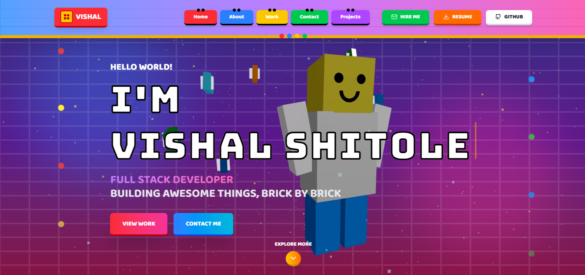

# 🚀 LEGO Theme Portfolio

A modern, animated 3D developer portfolio built with React, Three.js, TailwindCSS, and motion effects — designed to help you stand out and showcase your skills creatively.

---

This portfolio is inspired by the LEGO philosophy — creativity, structure, and building ideas block by block.

Just like LEGO bricks, every part of this project is modular, reusable, and carefully assembled. From UI components to 3D scenes, each element is designed to snap together cleanly while still allowing flexibility and experimentation.

🧩 LEGO Theme Highlights

🧱 Block-based design thinking
Components are structured like LEGO bricks — simple on their own, powerful when combined.

🎨 Playful yet professional UI
Rounded shapes, bold colors, and smooth animations create a fun experience without sacrificing clarity.

🚀 Built to explore and experiment
The 3D elements, motion effects, and layouts encourage curiosity, much like opening a box of LEGO pieces and imagining what you can build.

🛠 Scalable & maintainable architecture
Clean folder structure and reusable components make it easy to extend, refactor, or rebuild parts of the portfolio.

This LEGO-inspired approach reflects how I work as a developer:
build strong foundations, stay creative, and enjoy the process of turning ideas into something real.

## ⭐ Like This Project?
